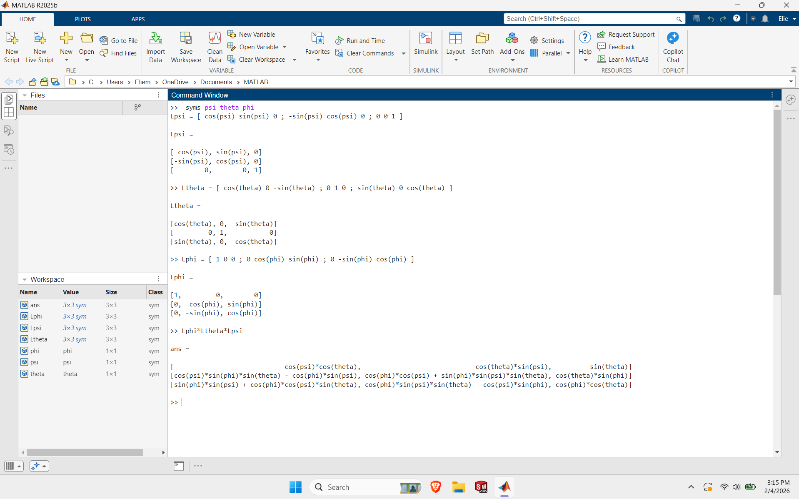
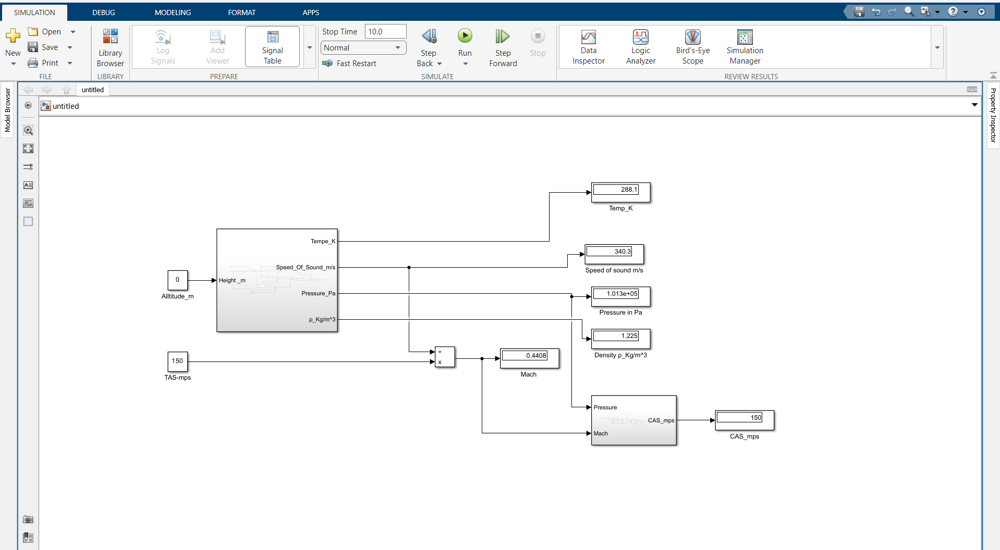
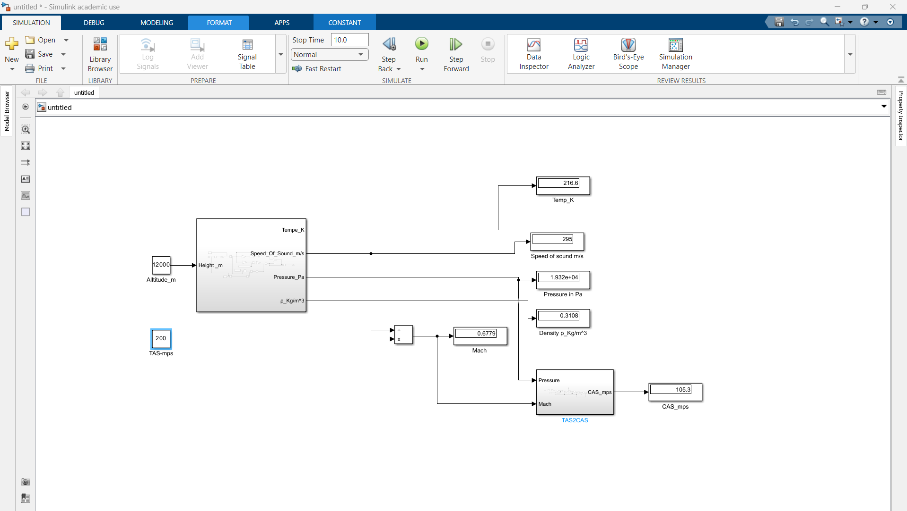

# ISA Atmosphere & Airspeed Conversion — MATLAB/Simulink

**Engineering simulation project by Elie Moussa**  
Polytech Nantes — 4A, Diplôme d’ingénieur TEM (Thermique, Énergétique et Mécanique)

## Overview

This project develops a MATLAB/Simulink workflow for atmospheric-state modelling and airspeed conversion across representative flight conditions. The model combines an International Standard Atmosphere (ISA) subsystem with a True Airspeed (TAS) to Calibrated Airspeed (CAS) conversion workflow and supporting coordinate-transformation logic.

The repository is presented as an engineering case study: model architecture, representative verification cases, visual evidence, and a technical report are kept together so that the work can be reviewed independently.

## Engineering objectives

- Model atmospheric properties as a function of altitude using ISA relationships.
- Convert TAS inputs to CAS within the Simulink workflow.
- Organize the model into clear, reusable subsystems.
- Implement supporting Earth-to-body transformation logic.
- Check model behaviour at representative altitude and airspeed conditions.
- Document the methodology and outputs in a technical report.

## Model architecture

<p align="center">
  
  
</p>

The model is decomposed into subsystems so that atmospheric calculations, airspeed conversion, and supporting transformations can be inspected and tested separately.

## Representative verification cases

<p align="center">
  
  
</p>

Two representative operating points are retained in the repository to show the model being exercised at substantially different atmospheric conditions.

## Tools used

- MATLAB
- Simulink

## Repository structure

```text
.
├── README.md
├── assets/
│   └── figures/
│       ├── atmosphere-model-overview.png
│       ├── earth-to-body-transformation.png
│       ├── isa-tas-cas-subsystem.png
│       ├── validation-12000m-tas-200.png
│       ├── validation-sea-level-tas-150.png
│       └── supporting/
├── docs/
│   └── isa-tas-cas-report.pdf
└── .gitignore
```

## Technical report

The full project report is available here:

**[Open the technical report](docs/isa-tas-cas-report.pdf)**

## Engineering context

This project is part of my development in numerical simulation for aerospace and thermal-fluid engineering. My current academic path at Polytech Nantes focuses on thermal, energy, and mechanical engineering, with long-term interests in aerospace propulsion, turbomachinery, thermal management, and simulation-driven engineering.

## Author

**Elie Moussa**  
4A Engineering Student — Polytech Nantes  
Thermique, Énergétique et Mécanique (TEM)  
BSc in Mechanical Engineering

- [LinkedIn](https://www.linkedin.com/in/moussaelie/)
- [Email](mailto:eliemoussacareer@outlook.com)

---

*The repository documents completed work only. Future projects and tools are added to the public portfolio when supporting technical evidence is available.*
