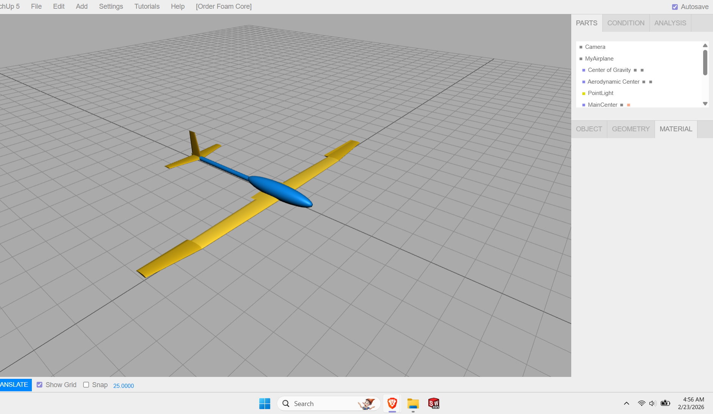
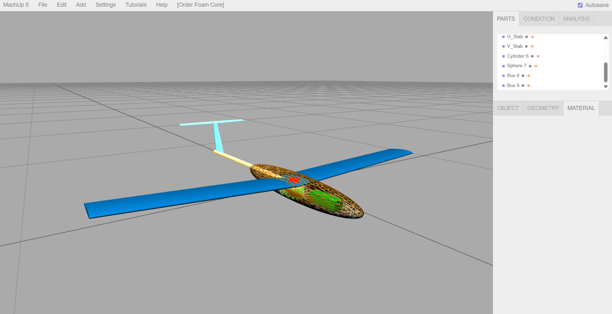
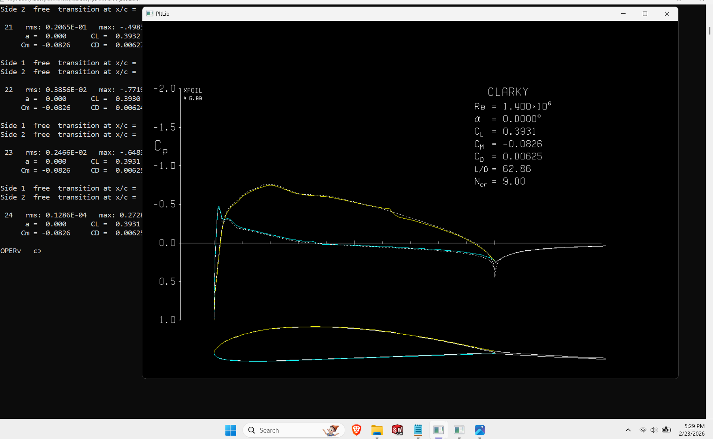
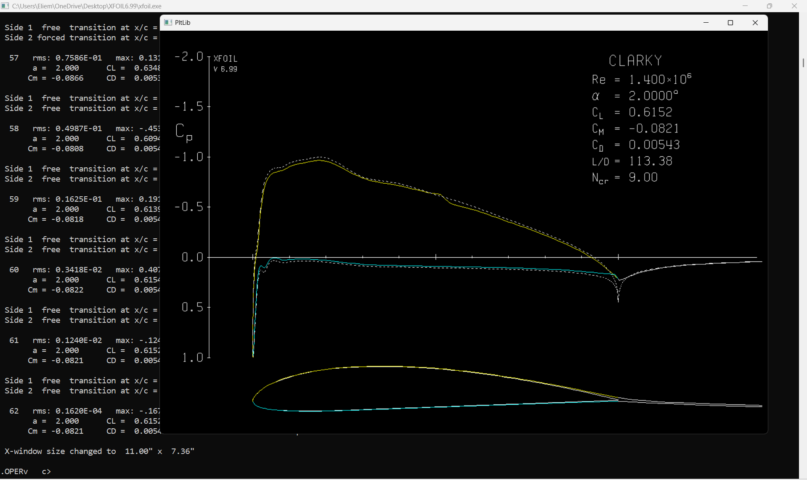

# Fixed-Wing Aerodynamic Analysis

**MachUp / XFOIL study of a conventional aircraft configuration and Clark Y airfoil**

## Engineering problem

The objective was to construct a conventional fixed-wing configuration and evaluate the aerodynamic behaviour of a Clark Y airfoil while improving the numerical quality of the XFOIL panel discretization.

## Objectives

- build the aircraft geometry in MachUp
- import and analyze the Clark Y airfoil in XFOIL
- improve panel quality before viscous analysis
- evaluate pressure distributions at selected angles of attack
- interpret lift, drag, and pitching-moment coefficients

## Methodology

The Clark Y airfoil was imported with **121 coordinate points**. The XFOIL paneling workflow was refined from **160 to 240 nodes** using PPAR/PANE. This reduced the reported maximum panel angle from approximately **9.09° to 6.42°** before running the viscous analysis.

The viscous analysis was performed at **Re = 1.4 × 10⁶** with **100 iterations**. Pressure-coefficient plots were generated and interpreted at selected angles of attack.

## Tools

- MachUp
- XFOIL

## Results

| Angle of attack | CL | CD | CM |
|---:|---:|---:|---:|
| 0° | ≈ 0.393 | ≈ 0.00625 | ≈ −0.0826 |
| 2° | ≈ 0.615 | ≈ 0.00543 | ≈ −0.0821 |

Increasing the angle of attack from 0° to 2° increased the lift coefficient in the analyzed cases, while the reported pitching moment remained negative and of similar magnitude.

## Visual evidence

  
  

  
  

## Validation / numerical-quality step

The panel-refinement step is retained because it shows an explicit attempt to improve the numerical discretization before interpreting aerodynamic outputs. The project does not claim experimental validation.

## Key engineering takeaways

This study demonstrates basic aerodynamic modelling, panel-quality refinement, viscous XFOIL setup, pressure-distribution interpretation, and quantitative reporting of aerodynamic coefficients.

[← Back to portfolio](../../README.md)
