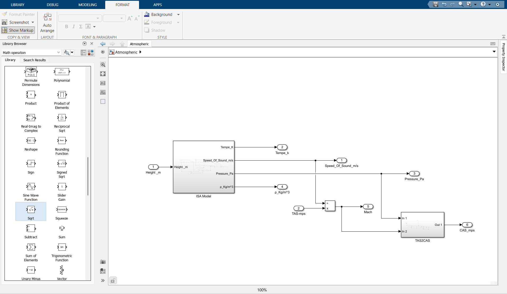

# ISA Atmosphere & TAS-to-CAS Conversion

**MATLAB/Simulink aerospace simulation study**

## Engineering problem

Aircraft-performance and flight-mechanics calculations depend on atmospheric state and on consistent airspeed definitions. This project develops a Simulink workflow that combines an **International Standard Atmosphere (ISA)** model with **True Airspeed (TAS) to Calibrated Airspeed (CAS)** conversion and supporting coordinate-transformation logic.

## Objectives

- compute atmospheric properties as a function of altitude using ISA relationships
- convert TAS inputs to CAS within a modular Simulink workflow
- separate atmospheric, airspeed-conversion, and transformation logic into inspectable subsystems
- evaluate model behaviour at representative operating points
- document the modelling workflow and outputs

## Methodology

The model is organized into subsystems so that the principal calculations can be inspected independently. Representative test cases at different altitudes and airspeeds are retained as verification evidence.

### Model architecture

  
  

### Representative verification cases

  
  

## Tools

- MATLAB
- Simulink

## Validation / evidence

The repository includes representative operating-point outputs and the complete technical report used to document the modelling workflow. The available material supports qualitative verification across substantially different atmospheric conditions; no additional quantitative validation claim is made here beyond what is documented in the report.

## Technical report

**[Open the project report](docs/isa-tas-cas-report.pdf)**

## Key engineering takeaways

This project demonstrates subsystem-based engineering modelling, atmospheric-state calculations, airspeed-conversion logic, coordinate transformations, and structured presentation of simulation evidence.

[← Back to portfolio](../../README.md)
