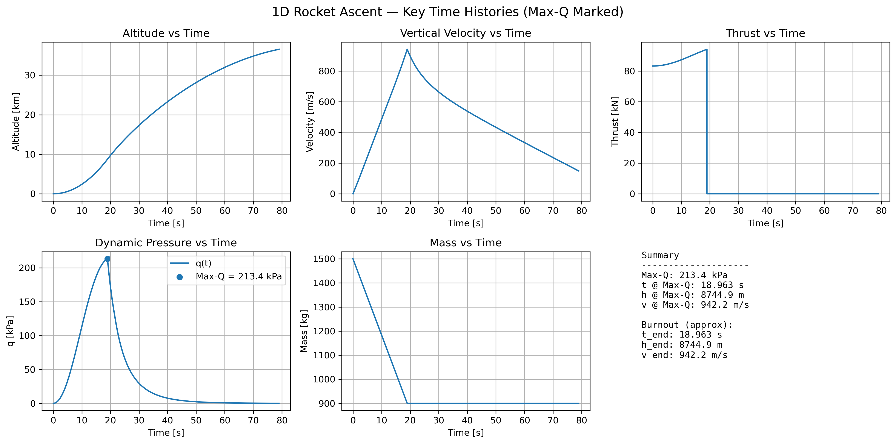

# Rocket Nozzle Performance & 1D Ascent Simulation

**Python-based implementation of ideal rocket-nozzle performance coupled to a simplified 1D vertical ascent model**

This project connects compressible-flow nozzle relations, atmospheric variation, vehicle dynamics, aerodynamic loading, and numerical integration in a single reproducible workflow.

<p align="center">
  
</p>

## Engineering problem

Rocket-engine thrust depends on both nozzle exit conditions and ambient pressure, while the vehicle trajectory depends on thrust, mass depletion, gravity, atmospheric density, and drag. The objective is to connect those effects in a **fundamentals-first 1D model** and evaluate:

- ideal nozzle thrust and specific impulse as functions of altitude
- vertical powered ascent and post-burn coast
- propellant depletion and burnout state
- dynamic pressure and Max-Q
- sensitivity of thrust to decreasing ambient pressure

This is a **1D engineering simulation**, not a CFD model.

## Model architecture

1. **Simplified ISA atmosphere** — temperature, pressure, and density as functions of altitude
2. **Ideal isentropic nozzle** — choked mass flow, exit Mach number, exit state, thrust, and specific impulse
3. **Vehicle dynamics** — vertical motion with altitude-dependent gravity, aerodynamic drag, and propellant mass depletion
4. **Numerical integration** — adaptive integration with `scipy.integrate.solve_ivp`

## Governing relations

### Ideal nozzle

Choked throat mass flow:

$$
\dot{m}=P_cA_t\sqrt{\frac{\gamma}{RT_c}}
\left(\frac{2}{\gamma+1}\right)^{\frac{\gamma+1}{2(\gamma-1)}}
$$

The supersonic exit Mach number is obtained from the isentropic area-Mach relation:

$$
\frac{A_e}{A_t}=\frac{1}{M_e}
\left[\frac{2}{\gamma+1}\left(1+\frac{\gamma-1}{2}M_e^2\right)\right]^{\frac{\gamma+1}{2(\gamma-1)}}
$$

Thrust:

$$
F=\dot{m}V_e+(P_e-P_a)A_e
$$

Specific impulse:

$$
I_{sp}=\frac{F}{\dot{m}g_0}
$$

### Vertical ascent

$$
\frac{dh}{dt}=v
$$

$$
\frac{dv}{dt}=\frac{F-D-mg(h)}{m}
$$

$$
\frac{dm}{dt}=-\dot{m}
$$

with

$$
D=\frac{1}{2}\rho C_DA_{ref}v|v|,
\qquad
q=\frac{1}{2}\rho v^2
$$

and altitude-dependent gravity:

$$
g(h)=g_0\left(\frac{R_E}{R_E+h}\right)^2
$$

## Baseline assumptions

| Parameter | Value |
|---|---:|
| Chamber pressure, $P_c$ | 7.0 MPa |
| Chamber temperature, $T_c$ | 3400 K |
| Exhaust specific-heat ratio, $\gamma$ | 1.22 |
| Exhaust molecular weight | 22 kg/kmol |
| Throat diameter | 0.10 m |
| Expansion ratio, $A_e/A_t$ | 20 |
| Initial mass | 1500 kg |
| Dry mass | 900 kg |
| Drag coefficient, $C_D$ | 0.45 |
| Reference area | 0.35 m² |
| Post-burn coast window | 60 s |

The atmosphere uses a simplified ISA treatment: a linear lapse-rate troposphere to 11 km followed by an isothermal continuation above 11 km.

## Numerical method

The trajectory is integrated with SciPy's adaptive `solve_ivp` solver using:

- maximum step: **0.05 s**
- relative tolerance: **1 × 10⁻⁷**
- absolute tolerance: **1 × 10⁻⁹**

The supersonic nozzle exit Mach number is solved with `scipy.optimize.brentq`.

## Baseline results

### Nozzle performance

| Quantity | Result |
|---|---:|
| Exit Mach number | ≈ 3.84 |
| Choked mass flow | ≈ 31.64 kg/s |
| Sea-level thrust | ≈ 83.3 kN |
| Thrust at 60 km | ≈ 99.2 kN |
| Sea-level $I_{sp}$ | ≈ 268.4 s |
| $I_{sp}$ at 60 km | ≈ 319.7 s |

Under the fixed chamber/nozzle assumptions, thrust increases with altitude as ambient pressure falls and the pressure-thrust penalty decreases.

### Ascent and aerodynamic loading

| Quantity | Result |
|---|---:|
| Propellant burn time | 18.963 s |
| Burnout altitude | 8.745 km |
| Burnout vertical velocity | 942.1 m/s |
| Max-Q | 213.4 kPa |
| Max-Q time | 18.963 s |
| Max-Q altitude | 8.745 km |
| Max-Q vertical velocity | 942.2 m/s |
| Maximum altitude in simulated window | 36.546 km |
| Vertical velocity at end of window | 148.9 m/s |

**Interpretation note:** **36.546 km is not apogee.** The vehicle still has positive vertical velocity at the end of the selected 60 s post-burn coast window, so this value is reported only as the maximum altitude reached within the simulation window.

## Reproducibility

The project is organized as a standalone computational study with source code, baseline data exports, and result figures retained for inspection.

```text
rocket-nozzle-1d-ascent/
├── README.md
├── requirements.txt
├── src/
│   └── rocket_nozzle_ascent.py
├── data/
│   ├── nozzle_altitude_sweep.csv
│   ├── rocket_ascent_summary.csv
│   └── rocket_ascent_timeseries.csv
└── figures/
    └── rocket-ascent-dashboard.png
```

Run with:

```bash
pip install -r requirements.txt
python src/rocket_nozzle_ascent.py
```

The source script regenerates the time histories, summary data, nozzle altitude sweep, and a result dashboard from the stated assumptions.

## Limitations

The model intentionally prioritizes transparent fundamentals over high fidelity. It assumes:

- one-dimensional vertical motion
- constant chamber conditions
- ideal-gas and isentropic nozzle flow
- fixed $\gamma$ and exhaust molecular weight
- constant drag coefficient and reference area
- no wind or trajectory steering
- no nozzle efficiency, combustion losses, or flow-separation model
- simplified atmosphere rather than a full standard-atmosphere implementation
- fixed-duration coast rather than integration to true apogee

The numerical values should therefore be interpreted as outputs of this simplified engineering model, not as flight predictions.

## Key engineering takeaways

This project demonstrates:

- use of compressible-flow and ideal-nozzle relations in a computational model
- coupling propulsion performance to atmospheric pressure
- interpretation of a 1D ascent model with gravity, drag, and propellant depletion
- Max-Q extraction from simulated time histories
- use of Python scientific-computing tools for numerical simulation and post-processing
- evaluation of assumptions, limitations, and numerical outputs

[← Back to portfolio](../../README.md)
